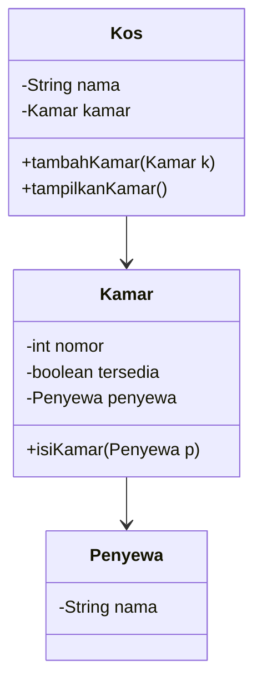

# budi mau nge Kos 

##  Deskripsi Kasus

Bisnis kos sering mengalami kendala dalam pengelolaan kamar, seperti tidak mengetahui apakah kamar kosong atau sudah terisi. Selain itu, pencatatan penyewa sering dilakukan secara manual sehingga kurang efisien.

Program ini dibuat untuk mensimulasikan sistem manajemen kos sederhana berbasis OOP yang dapat:

* Mengelola kamar
* Mengelola penyewa
* Menampilkan status kamar(tp disini saya masukin cuma 1 kamar)

---

## 📊 Class Diagram



---

## 💻 Kode Program Java

```java
public class Main {
    public static void main(String[] args) {

        Kos kos = new Kos("Kos AHAS");

        Kamar kamar1 = new Kamar(1);
        Penyewa penyewa1 = new Penyewa("Budi");

        kamar1.isiKamar(penyewa1);

        kos.tambahKamar(kamar1);
        kos.tampilkanKamar();
    }
}

class Kos {
    String nama;
    Kamar kamar;

    Kos(String nama) {
        this.nama = nama;
    }

    void tambahKamar(Kamar k) {
        this.kamar = k;
    }

    void tampilkanKamar() {
        System.out.println("Kos: " + nama);
        System.out.println("Kamar " + kamar.nomor + " - " +
            (kamar.tersedia ? "Kosong" : "Terisi oleh " + kamar.penyewa.nama));
    }
}

class Kamar {
    int nomor;
    boolean tersedia = true;
    Penyewa penyewa;

    Kamar(int nomor) {
        this.nomor = nomor;
    }

    void isiKamar(Penyewa p) {
        penyewa = p;
        tersedia = false;
    }
}

class Penyewa {
    String nama;

    Penyewa(String nama) {
        this.nama = nama;
    }
}
```

---

##  Screenshot Output

 contoh output program saat dijalankan:


---

##  Prinsip OOP yang Diterapkan

### 1. Encapsulation

Data seperti nama kos, nomor kamar, dan penyewa disimpan dalam class masing-masing sehingga lebih terstruktur.

### 2. Abstraction

Method seperti `isiKamar()` menyederhanakan proses pengisian kamar tanpa memperlihatkan detail internal.

### 3. Association

Terdapat hubungan antar class:

* Kos memiliki Kamar
* Kamar memiliki Penyewa

---

## Keunikan Program

Keunikan program ini dibandingkan dengan program lain:

* Menggunakan pendekatan sederhana tanpa menggunakan `ArrayList`, sehingga mudah dipahami oleh pemula
* Struktur program Sederhana
